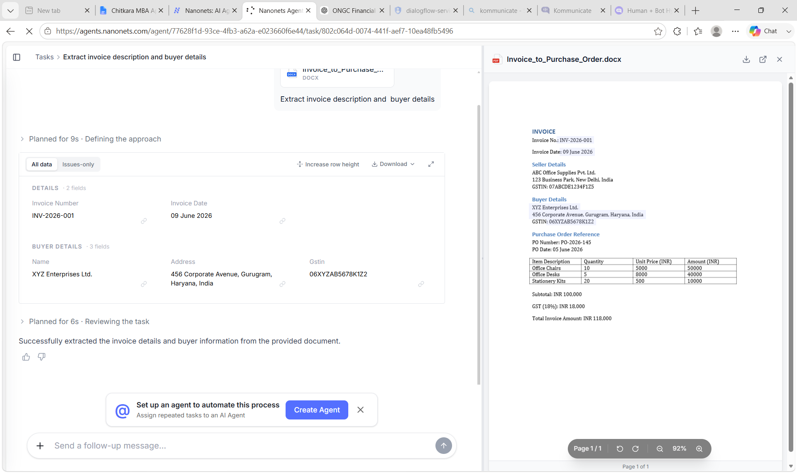

# 📄 Invoice-to-Purchase-Order Automation using Nanonets

## 📌 Project Overview

This project automates the process of extracting invoice data and converting it into structured Purchase Order (PO) information using **Nanonets AI OCR** technology. The solution eliminates manual data entry by automatically reading invoice documents, extracting key details, and organizing them into a standardized format for further procurement and finance operations.

The project demonstrates how Artificial Intelligence and Intelligent Document Processing (IDP) can improve efficiency, accuracy, and speed in Accounts Payable and Procurement workflows.

---

## 🎯 Objectives

- Automate invoice data extraction.
- Reduce manual data entry efforts.
- Improve accuracy in Purchase Order creation.
- Minimize processing time and operational costs.
- Demonstrate AI-powered document automation in finance.

---

## 🛠️ Technologies Used

- **Nanonets** – AI OCR & Document Processing
- **Invoice Documents** – Input Data Source
- **GitHub** – Version Control & Documentation

---

## 🔄 Workflow Process

1. Invoice document is uploaded to Nanonets.
2. AI OCR extracts key invoice information.
3. Extracted fields are validated and processed.
4. Data is converted into Purchase Order format.
5. Structured output is generated for procurement and finance teams.
6. Purchase Order information is ready for approval and further processing.

---

## 📊 Data Extracted from Invoice

The system can automatically capture:

- Invoice Number
- Vendor Name
- Invoice Date
- Purchase Order Number
- Item Description
- Quantity
- Unit Price
- Total Amount
- Tax Information
- Payment Terms

---

## 📁 Repository Structure

```text
Invoice-to-Purchase-Order-Automation-using-Nanonets/
│
├── README.md
└── Invoice_to_Purchase_Order.png
```

---

## 📸 Workflow Diagram

### Invoice to Purchase Order Automation Workflow



---

## 💼 Business Benefits

- Faster invoice processing.
- Reduced manual workload.
- Improved data accuracy.
- Lower operational costs.
- Enhanced procurement efficiency.
- Better compliance and audit readiness.

---

## 🎓 Academic Relevance

This project demonstrates the application of **Artificial Intelligence**, **Optical Character Recognition (OCR)**, and **Business Process Automation** in finance and procurement operations. It showcases how organizations can leverage intelligent automation to streamline document-intensive workflows.

---

## 🚀 Future Enhancements

- ERP Integration (SAP, Oracle, Tally).
- Automated Purchase Order Approval Workflow.
- Real-time Vendor Notifications.
- Fraud Detection and Invoice Validation.
- Dashboard for Invoice Processing Analytics.
- Multi-language Invoice Support.

---

## 👨‍💻 Author

**Dwij Kalra**  
MBA (Applied Finance)

GitHub: https://github.com/dwijkalra13

---

## ⭐ Support

If you found this project useful, consider giving this repository a **Star ⭐** and sharing your feedback.
